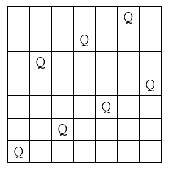

# September 2021 Puzzle
The *seven queens puzzle* is the problem of placing seven [chess queens](https://en.wikipedia.org/wiki/Queen_(chess)) on a 
7×7 chessboard so that no two queens threaten each other. Thus, a solution 
requires that no two queens share the same row, column, or diagonal.

The seven queens puzzle has 40 distinct solutions. If solutions that 
differ only by the [symmetry](https://en.wikipedia.org/wiki/Symmetry) operations of rotation and reflection of 
the board are counted as one, the puzzle has 6 solutions. 
These are called fundamental solutions.  One of the fundamental solutions is 
shown below.  **Find the other 5 fundamental solutions**.

